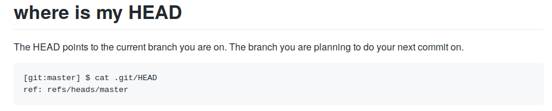
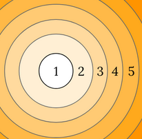
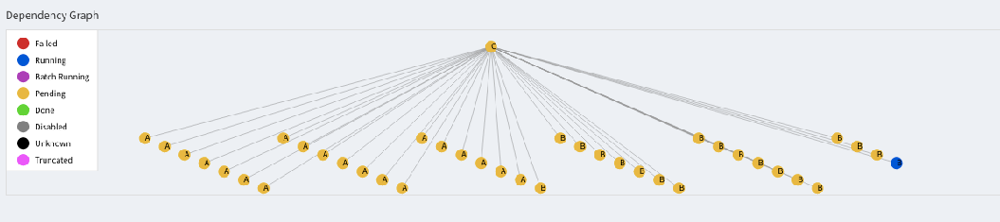
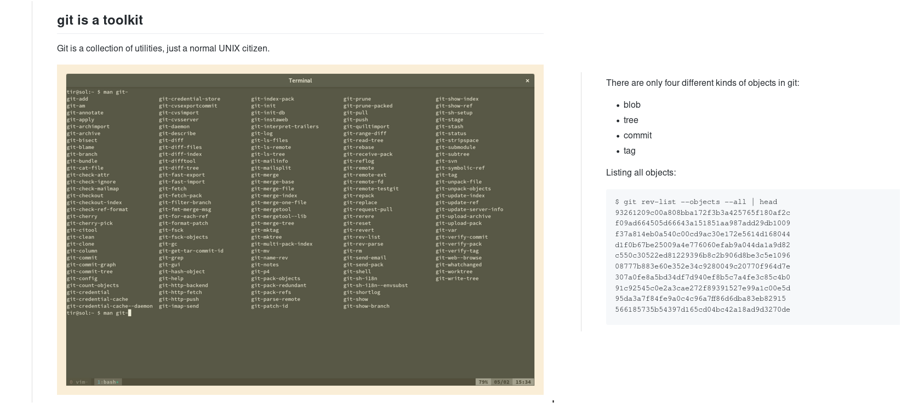
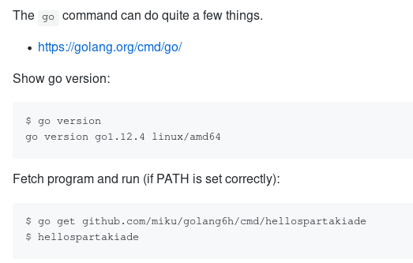
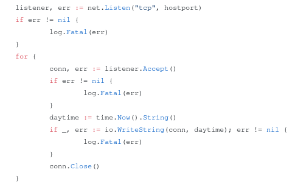
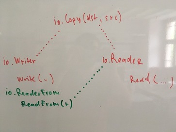

# Workshops and Talks

Over time I prepared various presentations and workshops, with their content
scattered over gists and repositories. This is merely a metarepo keeping track
of a few things, in rough chronological order (with
[some](https://github.com/miku/mdma-slides),
[things](https://github.com/miku/zeromq-slides),
[left](https://github.com/miku/elasticsearch-slides),
[out](https://github.com/miku/siskin/blob/master/docs/ai-overview/slides.md)).

* [Cloning isn't just for sheeps and galactic empires (git)](https://github.com/miku/workshops#cloning-isnt-just-for-sheeps-and-galactic-empires-git)
* [Complex workflows with Luigi (Python)](https://github.com/miku/workshops#complex-workflows-with-luigi-python)
* [Neural Nets intro (Python)](https://github.com/miku/workshops#neural-nets-intro-python)
* [Exploring Readers and Writers (Go)](https://github.com/miku/workshops#exploring-readers-and-writers-go)
* [Hands-On Lab: Build Your Own Index (data)](https://github.com/miku/workshops#hands-on-lab-build-your-own-index-data)
* [Hello Golang (Go)](https://github.com/miku/workshops#hello-golang-go)
* [PyTorch Tour (Python)](https://github.com/miku/workshops#pytorch-tour-python)
* [Data Processing 101 (Python)](https://github.com/miku/workshops#data-processing-101-with-python)
* [Hello Golang One Day Tour (Go)](https://github.com/miku/workshops#hello-golang-go-1)
* [Turn data into Go structs (Go)](https://github.com/miku/workshops#turn-data-into-go-struct-go)
* [Machine Learning with Go (Go)](https://github.com/miku/workshops#machine-learning-with-go-go)
* [Packaging Python Applications (Python)](https://github.com/miku/workshops#packaging-python-python)
* [Batch data processing with Luigi (Python)](https://github.com/miku/workshops#batch-data-processing-with-luigi-python)
* [Git bits (git)](https://github.com/miku/workshops#git-bits-git)
* [Intro to Go modules (Go)](https://github.com/miku/workshops#intro-to-go-modules)
* [Go in 6 hours (Go)](https://github.com/miku/workshops#go-in-6-hours)
* [A short tour through net and net/http (Go)](https://github.com/miku/workshops#a-short-tour-through-net-and-nethttp)
* [IO in 15 minutes (Go)](https://github.com/miku/workshops#io-in-15-minutes)
* [Review of Concurrency in Go](https://github.com/miku/workshops#review-of-concurrency-in-go)

## Cloning isn't just for sheeps and galactic empires (git)

* 2014-12-16, internal presentation
* [https://gist.github.com/miku/430b9ea1b4f18f7dc88a](https://gist.github.com/miku/430b9ea1b4f18f7dc88a)

## Complex Workflows with Luigi (Python)

* [LPUG](https://www.meetup.com/Leipzig-Python-User-Group/) -- Nov 10, 2015
* [https://github.com/miku/lpug-luigi](https://github.com/miku/lpug-luigi)
* Thanks to [kampfschlaefer](https://github.com/kampfschlaefer) for introducing
  me to [Nix](https://github.com/kampfschlaefer/nix-topartists), the [purely
functional package manager](https://nixos.org/nix/).

## Neural nets intro (Python)

* At [Leipzig Python User
  Group](https://www.meetup.com/Leipzig-Python-User-Group/) Meeting at
[Basislager](https://www.basislager.co/), 2016-11-08, 7PM CET, with
[Philipp](https://github.com/philipphanemann)
* [https://github.com/miku/nntour](https://github.com/miku/nntour)

## Exploring readers and writers (Go)

* [Golab.io](https://www.golab.io/), January 21, 2017, Prato (IT)
* [https://github.com/miku/exploreio](https://github.com/miku/exploreio)

## Hands-On Lab: Build Your Own Index (data)

* three-hour lab at [*Deutscher Bibliothekartag*](https://de.wikipedia.org/wiki/Bibliothekartag#Bibliothekartag), 2017-06-02, Frankfurt am Main, with [Tracy](https://twitter.com/nabatz)
* [https://github.com/miku/siskin/blob/master/docs/btag-2017/btag-2017.md](https://github.com/miku/siskin/blob/master/docs/btag-2017/btag-2017.md)

## Hello Golang (Go)

* Material presented at [jenadevs
  meetup](https://www.meetup.com/de-DE/jenadevs/) 008, June 8, 2017 18:00 CEST
at [Friedrich-Schiller-Universität Jena](https://www.uni-jena.de/).
* [https://github.com/miku/hellogolang](https://github.com/miku/hellogolang)

## PyTorch tour (Python)

A short tour through PyTorch.

* At [Leipzig Python User Group](https://www.meetup.com/Leipzig-Python-User-Group/), 2018-02-13 19:00 at [Basislager](https://www.basislager.co/).
* [https://github.com/miku/pytorch-tour](https://github.com/miku/pytorch-tour)

## Data Processing 101 with Python

* 2018-04-15 14:00-15:00, Input session for [Coding da Vinci Ost
  2018](https://codingdavinci.de/events/ost/)
* [https://github.com/miku/sundaypython](https://github.com/miku/sundaypython)

## Hello Golang (Go)

* 2018-10-12, 09:00-17:00, at [devopenspace](https://devopenspace.de/), [Basislager](https://www.basislager.co/), Leipzig
* A one day introductory Golang workshop, exploring Go through the [Go tour](https://tour.golang.org/)
* [https://github.com/miku/golangintro](https://github.com/miku/golangintro)
* [binpic](https://github.com/miku/binpic) was inspired by one of the many
  interesting conversations at devopenspace

## Turn data into Go struct (Go)

* Lightning talk at [Golab](https://www.golab.io/) 2018, 2018-10-22, 18:00
* [https://gist.github.com/miku/39e4273d15abfd7e4297071338da3349](https://gist.github.com/miku/39e4273d15abfd7e4297071338da3349)

## Machine Learning with Go (Go)

* A short tour through ML libraries in Go, [golab 2018](https://golab.io), 2018-10-23, 10:30-12:00, Florence (IT)
* [https://github.com/miku/mlgo](https://github.com/miku/mlgo)

## Packaging Python (Python)

* Dists, zips, debs and docker, 2018-11-17 at PyconBalkan, Belgrade (SRB)
* [https://github.com/miku/packpy](https://github.com/miku/packpy)

## Batch data processing with Luigi (Python)

* 2018-11-17, 17:00-18:30 at PyConBalkan, Belgrade (SRB)
* [https://github.com/miku/batchdata](https://github.com/miku/batchdata)

## Git bits (git)

* 2019-02-25, 12:30-13:30 at UBL
* [https://github.com/miku/gitbits](https://github.com/miku/gitbits)

## Intro to Go modules

* 2019-04-15, 19:00 at Go and Cloud Native User Group, Leipzig
* [https://github.com/miku/gomodintro](https://github.com/miku/gomodintro)

## Go in 6 hours

* 2019-04-27, 10:00 at Spartakiade 2019, Berlin
* [https://github.com/miku/golang6h](https://github.com/miku/golang6h)

## A short tour through net and net/http

* 2019-04-28, 10:00 at Spartakiade 2019, Berlin
* [https://github.com/miku/golangnetpkg](https://github.com/miku/golangnetpkg)

## IO in 15 minutes

* 2019-06-14, 19:00 at Go and Cloud Native User Group, Leipzig
* [https://github.com/miku/io15min](https://github.com/miku/io15min)

## Review of Concurrency in Go

* 2019-09-27, 19:00 at Golang User Group, Leipzig
* [http://github.com/miku/cignotes](http://github.com/miku/cignotes)

