# Workshops and Talks

Over time I prepared various presentations and workshops, with their content
scattered over gists and repositories. This is merely a metarepo keeping track
of a few things, in rough chronological order (with
[some](https://github.com/miku/mdma-slides),
[things](https://github.com/miku/zeromq-slides),
[left](https://github.com/miku/elasticsearch-slides),
[out](https://github.com/miku/siskin/blob/master/docs/ai-overview/slides.md)).

* [Cloning isn't just for sheeps and galactic empires (git)](https://github.com/miku/workshops#cloning-isnt-just-for-sheeps-and-galactic-empires-git)
* [Complex workflows with Luigi (Python)](https://github.com/miku/workshops#complex-workflows-with-luigi-python)
* [Neural Nets intro (Python)](https://github.com/miku/workshops#neural-nets-intro-python)
* [Exploring Readers and Writers (Go)](https://github.com/miku/workshops#exploring-readers-and-writers-go)
* [Hands-On Lab: Build Your Own Index (data)](https://github.com/miku/workshops#hands-on-lab-build-your-own-index-data)
* [Hello Golang (Go)](https://github.com/miku/workshops#hello-golang-go)
* [PyTorch Tour (Python)](https://github.com/miku/workshops#pytorch-tour-python)
* [Data Processing 101 (Python)](https://github.com/miku/workshops#data-processing-101-with-python)
* [Hello Golang One Day Tour (Go)](https://github.com/miku/workshops#hello-golang-go-1)
* [Turn data into Go structs (Go)](https://github.com/miku/workshops#turn-data-into-go-struct-go)
* [Machine Learning with Go (Go)](https://github.com/miku/workshops#machine-learning-with-go-go)
* [Packaging Python Applications (Python)](https://github.com/miku/workshops#packaging-python-python)
* [Batch data processing with Luigi (Python)](https://github.com/miku/workshops#batch-data-processing-with-luigi-python)
* [Git bits (git)](https://github.com/miku/workshops#git-bits-git)
* [Intro to Go modules (Go)](https://github.com/miku/workshops#intro-to-go-modules)
* [Go in 6 hours (Go)](https://github.com/miku/workshops#go-in-6-hours)
* [A short tour through net and net/http (Go)](https://github.com/miku/workshops#a-short-tour-through-net-and-nethttp)
* [IO in 15 minutes (Go)](https://github.com/miku/workshops#io-in-15-minutes)
* [Review of Concurrency in Go (Go)](https://github.com/miku/workshops#review-of-concurrency-in-go)
* [Creative Jupyter (Python, data)](https://github.com/miku/workshops#creative-jupyter)
* [Beautiful I/O (Go)](https://github.com/miku/workshops#beautiful-io)
* [Writing robust concurrent programs (Go)](https://github.com/miku/workshops#writing-robust-concurrent-programs)
* [Library Carpentry UBL (git)](https://github.com/miku/workshops#library-carpentry-ubl)
* [HTTP Getaway 1 Extension Points (Go)](https://github.com/miku/workshops#http-getaway-1-extension-points)
* [HTTP Getaway 2 Intro to Proxies (Go)](https://github.com/miku/workshops#http-getaway-2-intro-to-proxies)
* [Library Carpentry AALS (git)](https://github.com/miku/workshops#library-carpentry-aals)
* [Haystack (Go, data)](https://github.com/miku/workshops#haystack)
* [Productive Go (Go)](https://github.com/miku/workshops#productive-go)
* [Fast filters in Go (Go, Unix)](https://github.com/miku/workshops#fast-filters-in-go)
* [(Fuzzy) Matching with command line tools and Go (Go, data)](https://github.com/miku/workshops#fuzzy-matching-with-command-line-tools-and-go)
* [Seeking Data (Go, data)](https://github.com/miku/workshops/#seeking-data)
* [Go for programmers (Go)](https://github.com/miku/workshops/#go-for-programmers)
* [A data web service (Go, data)](https://github.com/miku/workshops/#a-data-web-service)
* [The rsync for the cloud era: Rclone (Go)](https://github.com/miku/workshops/#the-rsync-for-the-cloud-era-rclone)
* [Glamorous command line apps (Go)](https://github.com/miku/workshops/#glamorous-command-line-apps)
* [State of Go in 2022 (Go)](https://github.com/miku/workshops#state-of-go-in-2022)
* [Go energy efficiency (Go)](https://github.com/miku/workshops#go-energy-efficiency)
* [Sustainability and security in the Go ecosystem (Go)](https://github.com/miku/workshops#sustainability-and-security-in-the-go-ecosystem)
* [Cgo experiments (Go, C)](https://github.com/miku/workshops#cgo-experiments)
* [Ollama Testdrive (Go, data)](https://github.com/miku/workshops#ollama-testdrive)
* [Notes on Prompt Engineering (data)](https://github.com/miku/workshops#notes-on-prompt-engineering)
* [1BRC in Go (Go, data)](https://github.com/miku/workshops#1brc-in-go)
* [Exercises in Performance Optimizations (Go, data)](https://github.com/miku/workshops#exercises-in-performance-optimizations)
* [Run your own VPN with headscale (Go, net)](https://github.com/miku/workshops#run-your-own-vpn-with-headscale)
* [AI x Library Explorations](https://github.com/miku/workshops?tab=readme-ov-file#ai-x-library-explorations)
* [What happens when you type a prompt into ollama? (Go, data, ai)](https://github.com/miku/workshops?tab=readme-ov-file#what-happens-when-you-type-a-prompt-into-ollama)
* [Open Models for AI applications (data, ai)](https://github.com/miku/workshops?tab=readme-ov-file#open-models-for-ai-applications)
* [Writing a simple agent in Go (go, ai)](https://github.com/miku/workshops?tab=readme-ov-file#writing-a-simple-agent-in-go)

## Cloning isn't just for sheeps and galactic empires (git)

* 2014-12-16, internal presentation
* [https://gist.github.com/miku/430b9ea1b4f18f7dc88a](https://gist.github.com/miku/430b9ea1b4f18f7dc88a)

## Complex Workflows with Luigi (Python)

* [LPUG](https://www.meetup.com/Leipzig-Python-User-Group/) -- Nov 10, 2015
* [https://github.com/miku/lpug-luigi](https://github.com/miku/lpug-luigi)
* Thanks to [kampfschlaefer](https://github.com/kampfschlaefer) for introducing
  me to [Nix](https://github.com/kampfschlaefer/nix-topartists), the [purely
functional package manager](https://nixos.org/nix/).

## Neural nets intro (Python)

* At [Leipzig Python User
  Group](https://www.meetup.com/Leipzig-Python-User-Group/) Meeting at
[Basislager](https://www.basislager.co/), 2016-11-08, 7PM CET, with
[Philipp](https://github.com/philipphanemann)
* [https://github.com/miku/nntour](https://github.com/miku/nntour)

## Exploring readers and writers (Go)

* [Golab.io](https://www.golab.io/), January 21, 2017, Prato (IT)
* [https://github.com/miku/exploreio](https://github.com/miku/exploreio)

## Hands-On Lab: Build Your Own Index (data)

* three-hour lab at [*Deutscher Bibliothekartag*](https://de.wikipedia.org/wiki/Bibliothekartag#Bibliothekartag), 2017-06-02, Frankfurt am Main, with [Tracy](https://orcid.org/0000-0001-8718-9536)
* [https://github.com/miku/siskin/blob/master/docs/btag-2017/btag-2017.md](https://github.com/miku/siskin/blob/master/docs/btag-2017/btag-2017.md)

## Hello Golang (Go)

* Material presented at [jenadevs
  meetup](https://www.meetup.com/de-DE/jenadevs/) 008, June 8, 2017 18:00 CEST
at [Friedrich-Schiller-Universität Jena](https://www.uni-jena.de/).
* [https://github.com/miku/hellogolang](https://github.com/miku/hellogolang)

## PyTorch tour (Python)

A short tour through PyTorch.

* At [Leipzig Python User Group](https://www.meetup.com/Leipzig-Python-User-Group/), 2018-02-13 19:00 at [Basislager](https://www.basislager.co/).
* [https://github.com/miku/pytorch-tour](https://github.com/miku/pytorch-tour)

## Data Processing 101 with Python

* 2018-04-15 14:00-15:00, Input session for [Coding da Vinci Ost
  2018](https://codingdavinci.de/events/ost/)
* [https://github.com/miku/sundaypython](https://github.com/miku/sundaypython)

## Hello Golang (Go)

* 2018-10-12, 09:00-17:00, at [devopenspace](https://devopenspace.de/), [Basislager](https://www.basislager.co/), Leipzig
* A one day introductory Golang workshop, exploring Go through the [Go tour](https://tour.golang.org/)
* [https://github.com/miku/golangintro](https://github.com/miku/golangintro)
* [binpic](https://github.com/miku/binpic) was inspired by one of the many
  interesting conversations at devopenspace

## Turn data into Go struct (Go)

* Lightning talk at [Golab](https://www.golab.io/) 2018, 2018-10-22, 18:00
* [https://gist.github.com/miku/39e4273d15abfd7e4297071338da3349](https://gist.github.com/miku/39e4273d15abfd7e4297071338da3349)

## Machine Learning with Go (Go)

* A short tour through ML libraries in Go, [golab 2018](https://golab.io), 2018-10-23, 10:30-12:00, Florence (IT)
* [https://github.com/miku/mlgo](https://github.com/miku/mlgo)

## Packaging Python (Python)

* Dists, zips, debs and docker, 2018-11-17 at [PyconBalkan](https://pyconbalkan.com/), Belgrade (SRB)
* [https://github.com/miku/packpy](https://github.com/miku/packpy)

## Batch data processing with Luigi (Python)

* 2018-11-17, 17:00-18:30 at [PyConBalkan](https://pyconbalkan.com/), Belgrade (SRB)
* [https://github.com/miku/batchdata](https://github.com/miku/batchdata)

## Git bits (git)

* 2019-02-25, 12:30-13:30 at [UBL](https://www.ub.uni-leipzig.de), Leipzig
* [https://github.com/miku/gitbits](https://github.com/miku/gitbits)

## Intro to Go modules

* 2019-04-15, 19:00 at [Go and Cloud Native User Group](https://www.meetup.com/Leipzig-Golang/) [#3](https://golangleipzig.space/posts/meetup-3-wrapup/), Leipzig
* [https://github.com/miku/gomodintro](https://github.com/miku/gomodintro)

## Go in 6 hours

* 2019-04-27, 10:00 at [Spartakiade 2019](https://spartakiade.org/), Berlin
* [https://github.com/miku/golang6h](https://github.com/miku/golang6h)

## A short tour through net and net/http

* 2019-04-28, 10:00 at [Spartakiade 2019](https://spartakiade.org/), Berlin
* [https://github.com/miku/golangnetpkg](https://github.com/miku/golangnetpkg)

## IO in 15 minutes

* 2019-06-14, 19:00 at [Go and Cloud Native User Group](https://golangleipzig.space) [#5](https://golangleipzig.space/posts/meetup-5-wrapup/), Leipzig
* [https://github.com/miku/io15min](https://github.com/miku/io15min)

## Review of Concurrency in Go

* 2019-09-27, 19:00 at [Golang User Group](https://golangleipzig.space) [#7](https://golangleipzig.space/posts/meetup-7-wrapup/), Leipzig
* [http://github.com/miku/cignotes](http://github.com/miku/cignotes)

## Creative Jupyter

* 2019-10-04, 11:30 at [PyCon Balkan 2019](https://pyconbalkan.com/), Belgrade
* [https://github.com/miku/creativejupyter](https://github.com/miku/creativejupyter)

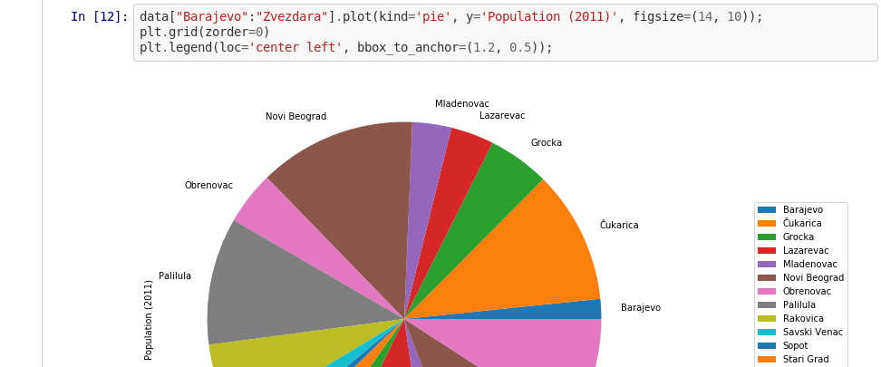

## Beautiful I/O

* 2019-10-21, 11:15 at [GOLAB 2019](https://golab.io/), Florence
* [https://github.com/miku/beautifulio](https://github.com/miku/beautifulio)

## Writing robust concurrent programs

* 2019-10-22, 14:30 at [GOLAB 2019](https://golab.io/), Florence
* [https://github.com/miku/concgo](https://github.com/miku/concgo)

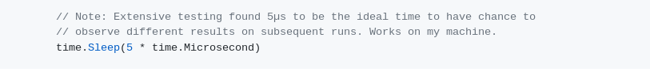

## Library Carpentry UBL

* 2019-11-04 &mdash; 2019-11-05, 09:00&mdash;16:30,
  [Library Carpentry](https://librarycarpentry.org/),
  [Bibliothek
  Medizin/Naturwissenschaft](https://twitter.com/ubleipzig/status/1191676882099593217),
  Leipzig
* Introduction to Git, with [RG](https://github.com/geyslein/) (shell), [TH](https://github.com/thoffma) (OpenRefine), [olf42](https://github.com/olf42) (Python)
* [website](https://ubleipzig.github.io/2019-11-04-leipzig/), [repo](https://github.com/ubleipzig/2019-11-04-leipzig), extra [material](https://github.com/miku/lc-extra)

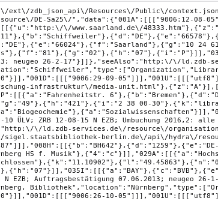

## HTTP Getaway (1) Extension Points

* 2020-02-21, 19:00 at [Leipzig Gophers](https://golangleipzig.space) [#9](https://golangleipzig.space/posts/meetup-9-wrapup/), Leipzig
* [https://github.com/miku/httpgetaway/blob/master/ExtensionPoints.md](https://github.com/miku/httpgetaway/blob/master/ExtensionPoints.md)

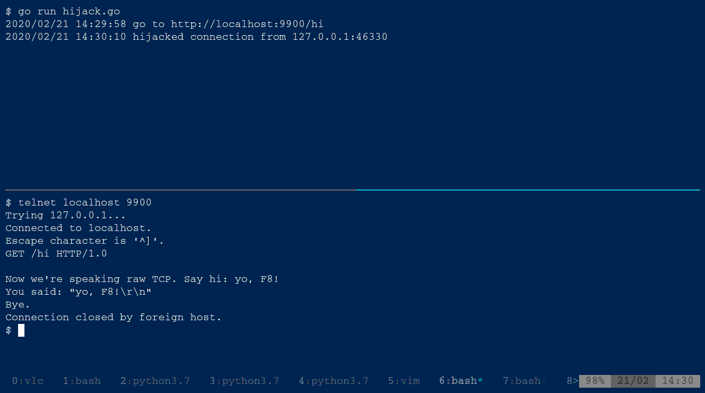

## HTTP Getaway (2) Intro to Proxies

* 2020-09-17, 19:00 at [Leipzig Gophers](https://golangleipzig.space) [#12](https://golangleipzig.space/posts/meetup-12-wrapup/), Leipzig (remote)
* [https://github.com/miku/httpgetaway/blob/master/ProxyIntro.md](https://github.com/miku/httpgetaway/blob/master/ProxyIntro.md)

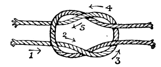

## Library Carpentry AALS

* 2020-10-09, 15:00&mdash;19:00,
  [Library Carpentry](https://librarycarpentry.org/),
  [AALS](https://www.igwbs.ch/),
  Remote
* Git Intro, with [RM](https://github.com/RabeaMue), [KUF](https://github.com/konrad), [TS](https://github.com/Tillsa)
* [website](https://zbmed.github.io/2020-09-21-LC_IG_WBS_online/), [repo](https://github.com/zbmed/2020-09-21-LC_IG_WBS_online/), extra [material](https://github.com/miku/lc-extra)

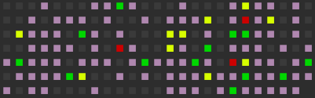

## Haystack

* 2020-10-16, 19:00 CET, [Leipzig Gophers](https://golangleipzig.space/) [#13](https://golangleipzig.space/posts/meetup-13-wrapup/), Leipzig (remote)
* [Haystack Object Storage and Go Implementation (seaweedfs)](https://github.com/miku/haystack)

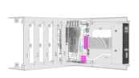

## Productive Go

* 2020-12-08, 18:30 CET, [Developer Group Leipzig](https://www.meetup.com/Developer-Group-Leipzig/events/273876459/), Leipzig (remote)
* [Productive Go](https://github.com/miku/productivego)

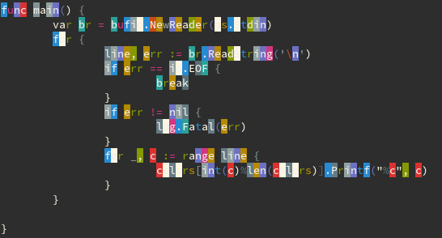

## Fast filters in Go

* 2020-12-18, 19:00 CET, [Leipzig Gophers](https://golangleipzig.space) [#15](https://golangleipzig.space/posts/meetup-15-wrapup/), Leipzig (remote)
* [Faster filters in
  Go](https://gist.github.com/miku/738f361c8156264626c74f9b717927ff#fast-parallel-filters-in-go),
lightning talk on [Software Tools](https://openlibrary.org/works/OL4617639W)
and [parallel](https://github.com/miku/parallel)

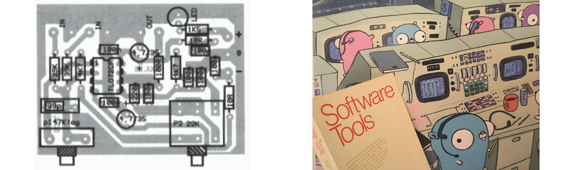

## (Fuzzy) Matching with command line tools and Go

* 2021-04-20, 19:00 CEST, [Leipzig Gophers](https://golangleipzig.space) [#17](https://golangleipzig.space/posts/meetup-17-wrapup/), Leipzig (remote)
* [Lightning Talk: (Fuzzy) Matching with command line tools and Go](https://gist.github.com/miku/fb429faad8b856caf6bba5305af024df)

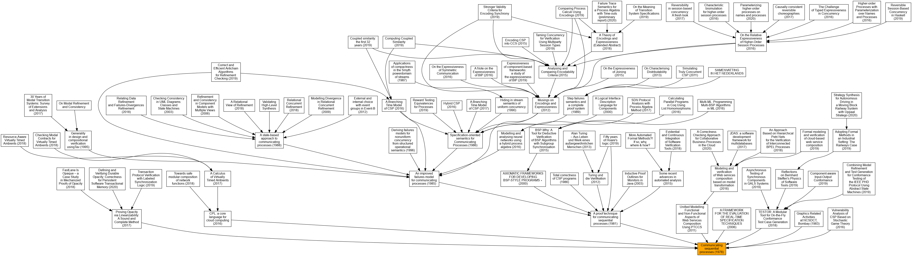

## Seeking Data

* 2021-05-25, 19:00 CEST, [Leipzig Gophers](https://golangleipzig.space) [#18](https://golangleipzig.space/posts/meetup-18-wrapup/), Leipzig (remote)
* [Lightning Talk: Seeking Data](https://gist.github.com/miku/6dcffb5c104bc44709c330ec90682189#seeking-data)

## Go for programmers

* 2021-06-11, 9-16 CEST, [Spartakiade](https://spartakiade.org/), Leipzig (remote)
* [Go for Programmers](https://github.com/miku/goforprogrammers)

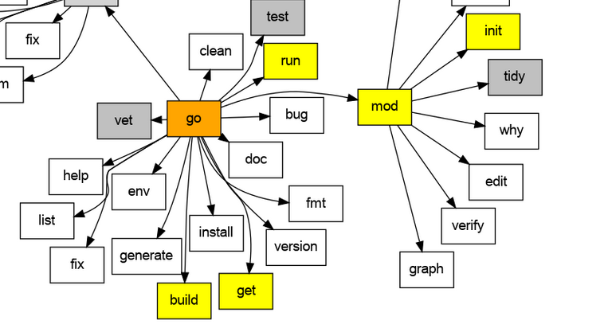

## A data web service

* 2021-11-23, 19:00 CET, [Leipzig Gophers](https://golangleipzig.space) [#23](https://golangleipzig.space/posts/meetup-23-wrapup/), Leipzig (remote)
* [Lightning Talk: A data web service](https://github.com/miku/dwstalk)

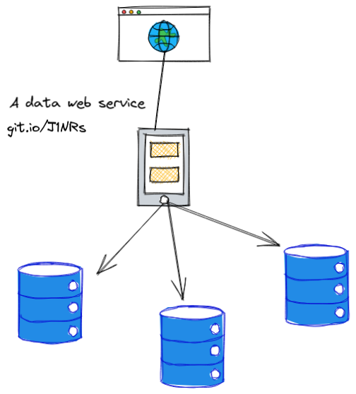

## The rsync for the cloud era: Rclone

* 2022-04-26, 19:00 CEST, [Leipzig Gophers](https://golangleipzig.space) [#26](https://golangleipzig.space/posts/meetup-26-wrapup/), Leipzig (remote)
* [Lightning Talk: The rsync for the cloud era: Rclone](https://github.com/miku/rclone-lightning-talk)

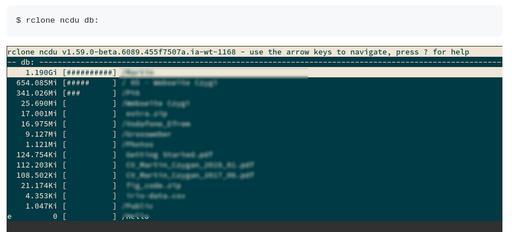

## Glamorous command line apps

* 2022-06-21, 19:00 CEST, [Leipzig Gophers](https://golangleipzig.space) [#28](https://golangleipzig.space/posts/meetup-28-wrapup/), Leipzig (remote)
* [Glamorous command line apps](https://github.com/miku/glamline)

## State of Go in 2022

* 2022-06-30, 19:00 CEST, [Leipzig Software Craft Meetup](https://www.meetup.com/le-software-craft-community/events/286403431/), Leipzig
* [State of Go in 2022](https://github.com/golang-leipzig/state-of-go-in-2022)

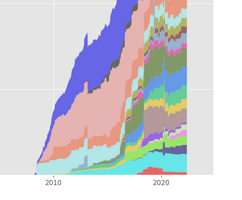

## Go energy efficiency

* 2022-11-29, 19:00 CEST, [Leipzig Gophers](https://golangleipzig.space) [#32](https://golangleipzig.space/posts/meetup-32-wrapup/), Leipzig
* [Go energy efficiency](https://github.com/miku/goenergy)

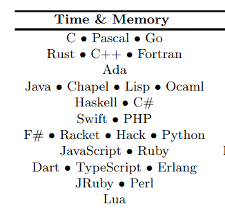

## Sustainability and Security in the Go ecosystem

* 2023-03-11, 14:00 CEST, [Chemnitzer Linux-Tage 2023](https://chemnitzer.linux-tage.de/2023) [L234](https://chemnitzer.linux-tage.de/2023/en/programm/beitrag/234), Chemnitz
* [Sustainability and Security in the Go ecosystem](https://github.com/miku/goeco)

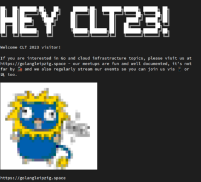

## Cgo experiments

* 2023-04-18, 19:00 CEST, [Leipzig Gophers](https://golangleipzig.space) [#35](https://golangleipzig.space/posts/meetup-35-wrapup), Leipzig
* [Cgo experiments](https://github.com/miku/cgosamples)

## Ollama testdrive

* 2023-11-21, 19:00 CET, [Leipzig Gophers](https://golangleipzig.space) [#38](https://golangleipzig.space/posts/meetup-38-wrapup), Leipzig
* [Ollama testdrive](https://github.com/miku/localmodels)

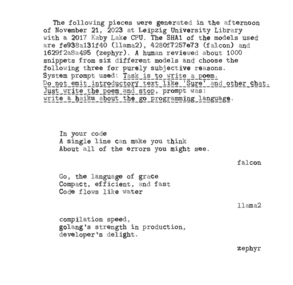

## Notes on Prompt Engineering

* 2024-02-29, 11:45 CET, [Writing Day](https://www.ub.uni-leipzig.de/aktuelle-ausstellungen/schreibtag/) 2024 at [UB Leipzig](https://www.ub.uni-leipzig.de)
* [Act as a helpful writing assistant / Notes on prompt engineering](https://raw.githubusercontent.com/miku/ubl-wd-2024-pe/main/UBL-WD-2024-PE-MC.pdf)

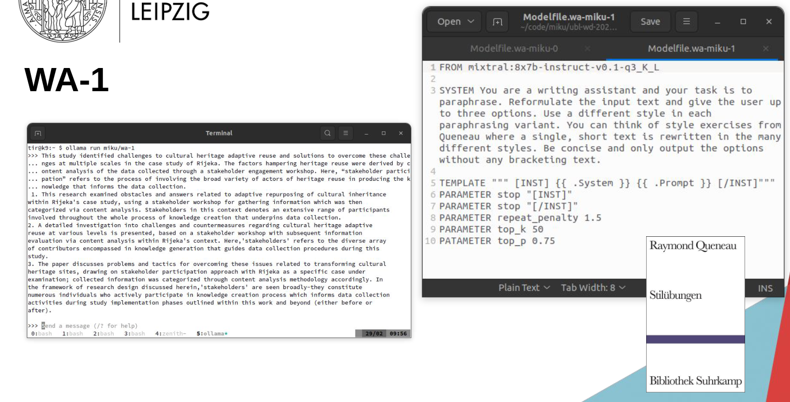

## 1BRC in Go

* 2024-04-30, 19:00 CET, Lightning talk at [Leipzig Gophers](https://golangleipzig.space/) [#42](https://golangleipzig.space/posts/meetup-42-wrapup/), Leipzig
* [1BRC in Go](https://github.com/golang-leipzig/1brc-in-go)

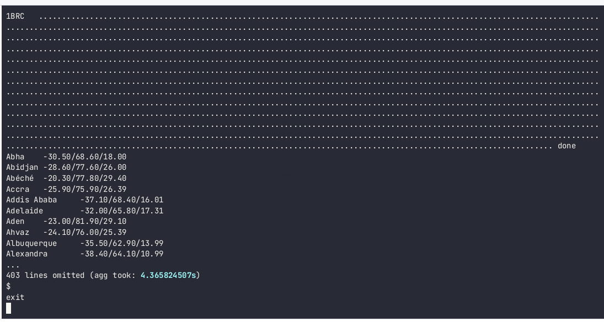

## Exercises in performance optimizations

* 2024-11-11, 14:30 CET, Workshop at [GOLAB 2024](https://golab.io), Florence
* [EXPO](https://github.com/miku/expo) &mdash; going from 179s and 2T CPU instructions (2004 inst/line) to 1.11s and 165B CPU instructions (165 inst/line), about **162x** speedup (using 12% of inst)

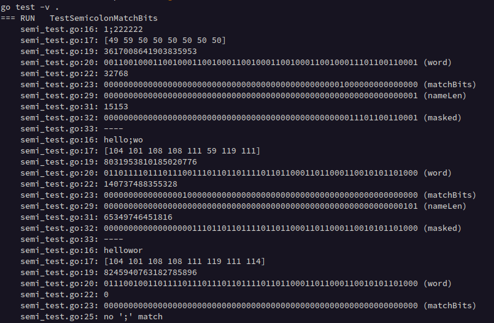

## Run your own VPN with headscale

* 2025-03-25, 19:00 CET, Lightning Talk at [Leipzig Gophers](https://golangleipzig.space) [#49](https://golangleipzig.space/posts/meetup-49-wrapup/)
* Slides: [LGO49-RYOVPN.pdf](https://golangleipzig.space/downloads/LGO49-RYOVPN.pdf)

[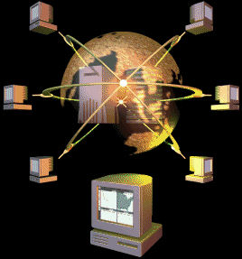](https://golangleipzig.space/downloads/LGO49-RYOVPN.pdf)

## AI x Library explorations

* [Prompt engineering](https://github.com/miku/prompteng) 2025-05-15
* [AIEXP-25-1](https://github.com/miku/aiexp-25-1) 2025-05-20
* [AIEXP-25-2](https://github.com/miku/aiexp-25-2) 2025-07-17
* [AIEXP-25-3](https://github.com/miku/aiexp-25-3) 2025-08-07
* [AIEXP-25-5](https://github.com/miku/aiexp-25-5) 2025-09-18
* [AIEXP-25-6](https://github.com/miku/aiexp-25-6) 2025-10-14
* [AIEXP-26-2](https://github.com/miku/aiexp-26-2) 2026-01-22

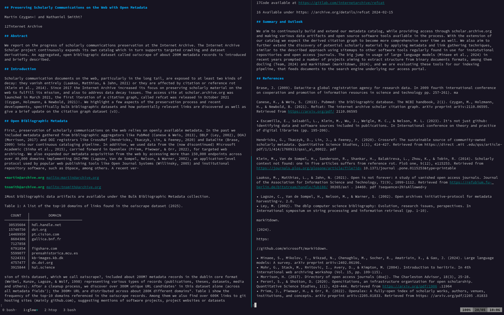

## What happens when you type a prompt into ollama?

* 2025-10-05, 14:30, Workshop at [GoLab 2025](https://golab.io), Florence (IT)
* [Repo](https://github.com/miku/ollamaintro) and [Slides](https://github.com/miku/ollamaintro/blob/main/Slides.md)

## Open Models for AI applications

* 2025-11-21, 11:30, Short Workshop at [KI-Tage Halle (Saale)](https://ki-tage.webwirtschaft.net/), Halle (Saale)
* [Slides](https://github.com/miku/localai-kith-2025)

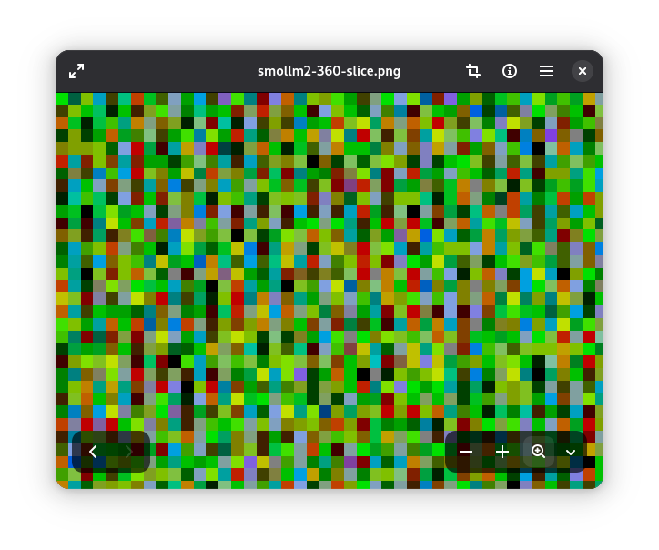

## Writing a simple agent in Go

* 2025-11-25, 19:00, lightning talk at [Leipzig Gophers](https://golangleipzig.space) [#56](https://golangleipzig.space/posts/meetup-56-wrapup/), Leipzig
* 2026-02-18, 19:00, lightning talk at [KI Meetup #9](https://klaustor-coworking.de/events/260218-ki-meetup-halle/), Halle (Saale)
* [Notes and code](https://github.com/miku/unplugged)

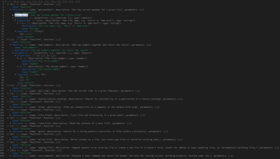
