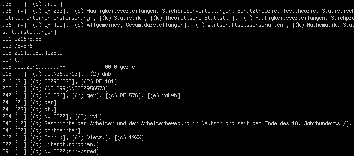
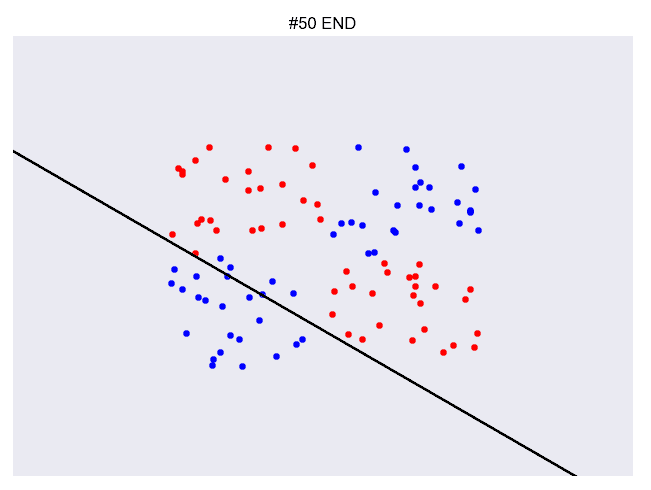
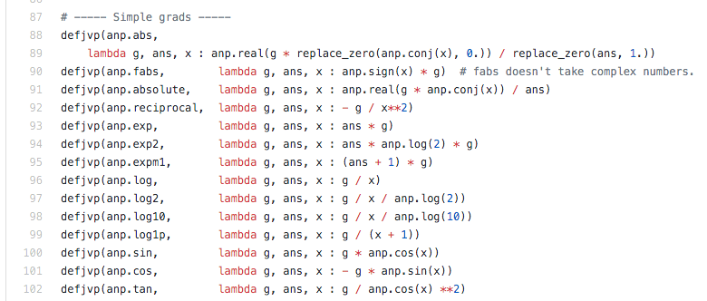
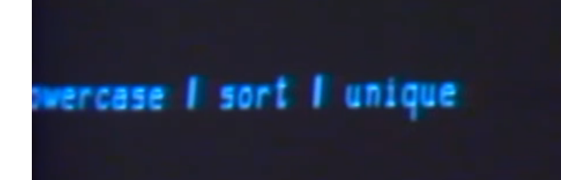
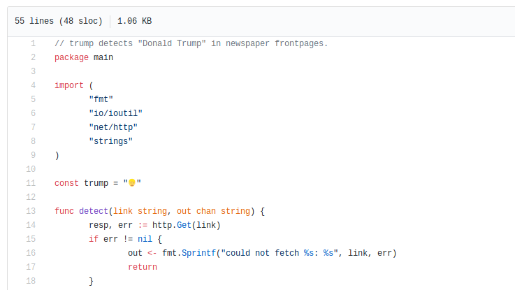
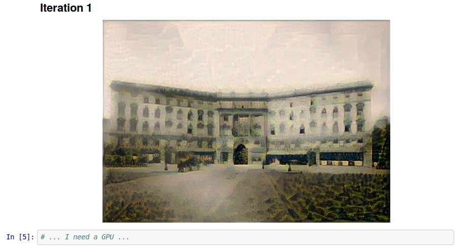
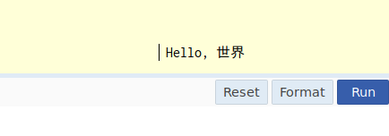
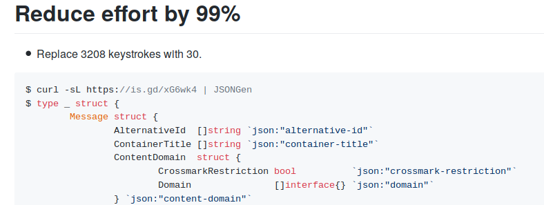

# meta

A level of indirection.

* [Complex workflows with Luigi (Python)](https://github.com/miku/meta#complex-workflows-with-luigi-python)
* [Neural Nets intro (Python)](https://github.com/miku/meta#neural-nets-intro-python)
* [PyTorch Tour (Python](https://github.com/miku/meta#pytorch-tour-python)
* [Exploring Readers and Writers (Go)](https://github.com/miku/meta#exploring-readers-and-writers-go)
* [Hello Golang (Go)](https://github.com/miku/meta#hello-golang-go)
* [Data Processing 101 (Python)](https://github.com/miku/meta#data-processing-101-with-python)
* [Hello Golang One Day Tour (Go)](https://github.com/miku/meta#hello-golang-go-1)
* [Turn data into Go structs (Go)](https://github.com/miku/meta#turn-data-into-go-struct-go)
* [Machine Learning with Go (Go)](https://github.com/miku/meta#machine-learning-with-go-go)

## Complex Workflows with Luigi (Python)

* LPUG -- Nov 10, 2015
* [https://github.com/miku/lpug-luigi](https://github.com/miku/lpug-luigi)
* Thanks to [kampfschlaefer](https://github.com/kampfschlaefer) for introducing
  me to [Nix](https://github.com/kampfschlaefer/nix-topartists), the [purely
functional package manager](https://nixos.org/nix/).

## Neural nets intro (Python)

* At Leipzig Python User Group Meeting at Basislager, 2016-11-08, 7PM CET.
* [https://github.com/miku/nntour](https://github.com/miku/nntour)

## PyTorch tour (Python)

A short tour through PyTorch.

* At Leipzig Python User Group, 2018-02-13 19:00 at Basislager.
* [https://github.com/miku/pytorch-tour](https://github.com/miku/pytorch-tour)

## Exploring readers and writers (Go)

* Golab.io, January 21, 2017, Prato (IT)
* [https://github.com/miku/exploreio](https://github.com/miku/exploreio)

## Hello Golang (Go)

* Material presented at jenadevs meetup 008, June 8, 2017 18:00 CEST at Friedrich-Schiller-Universität Jena.
* [https://github.com/miku/hellogolang](https://github.com/miku/hellogolang)

## Data Processing 101 with Python

* Input session for [Coding da Vinci Ost 2018](https://codingdavinci.de/events/ost/)
* [https://github.com/miku/sundaypython](https://github.com/miku/sundaypython)

## Hello Golang (Go)

* 2018-10-12, 09:00-17:00, at [devopenspace](https://devopenspace.de/), Basislager, Leipzig
* A one day introductory Golang workshop, exploring Go through the [Go tour](https://tour.golang.org/)
* [https://github.com/miku/golangintro](https://github.com/miku/golangintro)

## Turn data into Go struct (Go)

* Lightning talk at Golab 2018, 2018-10-22, 18:00
* [https://gist.github.com/miku/39e4273d15abfd7e4297071338da3349](https://gist.github.com/miku/39e4273d15abfd7e4297071338da3349)

## Machine Learning with Go (Go)

* A short tour through ML libraries in Go, [golab 2018](https://golab.io), 2018-10-23, 10:30-12:00, Florence (IT)
* [https://github.com/miku/mlgo](https://github.com/miku/mlgo)

